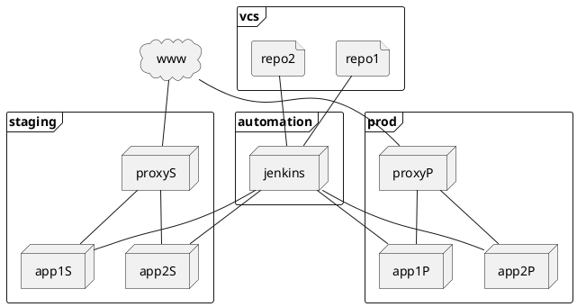

# Deployment

```puml
@startuml

frame vcs {
  file repo1
  file repo2
}
frame automation {
  node jenkins
}
repo1 -- jenkins
repo2 -- jenkins
frame staging {
  node proxyS
  node app1S
  node app2S
  proxyS -- app1S
  proxyS -- app2S
}
jenkins -- app1S
jenkins -- app2S
frame prod {
  node proxyP
  node app1P
  node app2P
  proxyP -- app1P
  proxyP -- app2P
}
jenkins -- app1P
jenkins -- app2P
cloud www
www -- proxyS
www -- proxyP

@enduml
```