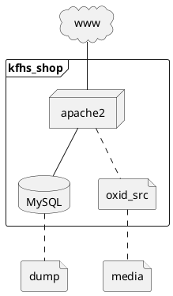
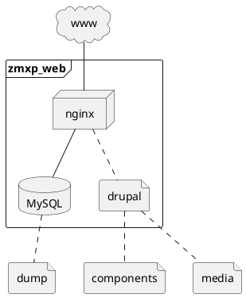
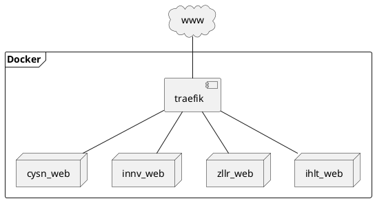

# Virtual Servers

* v45526.1blu.de (2 CPU-Cores, 4 GB RAM, 120 GB SSD)
* v37395.1blu.de (4 CPU-Cores, 12 GB RAM, 240 GB SSD)

## v45526.1blu.de (Staging)

Setup 1: kaufhausHESSEN Online Shop

Setup 2: Drupal (for different web sites)

Setup 3: Docker

Docker container:

* cysn_web
    * Docker image: [nginx:alpine](https://hub.docker.com/_/nginx/) 
* innv_web
    * Docker image: [nginx:alpine](https://hub.docker.com/_/nginx/) 
* zllr_web
    * Docker image: [nginx:alpine](https://hub.docker.com/_/nginx/) 

Domains:

* cysen.se

## v37395.1blu.de (Production)

Domains:

* cysense.de
* innoviter.com
* zoeller.biz
